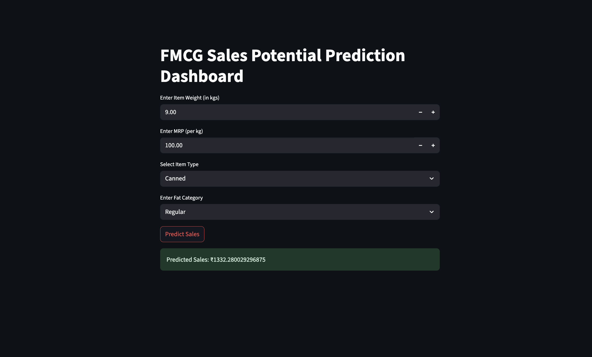
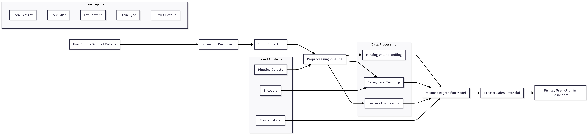
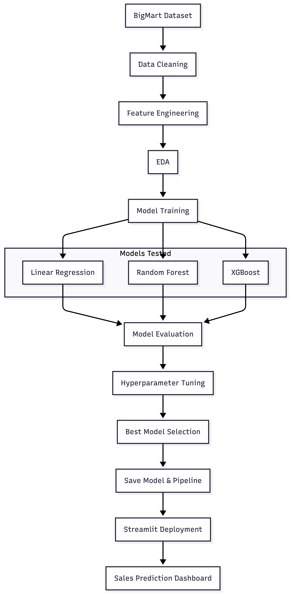

# FMCG Sales Potential Prediction Dashboard

 

  
  
  
  
  

  

# Table of Contents

- [Project Overview](#project-overview)
- [Problem Statement](#problem-statement)
- [System Architecture](#system-architecture)
- [Dataset Used](#dataset-used)
  - [Key Features Used](#key-features-used)
  - [Target Variable](#target-variable)
- [Tech Stack Used](#tech-stack-used)
  - [Programming Language](#programming-language)
  - [Libraries & Frameworks](#libraries--frameworks)
    - [Data Processing](#data-processing)
    - [Data Visualization](#data-visualization)
    - [Machine Learning](#machine-learning)
    - [Model Deployment](#model-deployment)
    - [Model Serialization](#model-serialization)
- [Machine Learning Workflow](#machine-learning-workflow)
  - [1. Data Cleaning](#1-data-cleaning)
  - [2. Feature Engineering](#2-feature-engineering)
  - [3. Exploratory Data Analysis (EDA)](#3-exploratory-data-analysis-eda)
  - [4. Model Training](#4-model-training)
  - [5. Hyperparameter Tuning](#5-hyperparameter-tuning)
- [Model Performance](#model-performance)
- [Dashboard Features](#dashboard-features)
  - [Dashboard Inputs](#dashboard-inputs)
  - [Dashboard Output](#dashboard-output)
- [Key Insights From The Model](#key-insights-from-the-model)
- [Challenges Faced](#challenges-faced)
  - [1. Lack of Product Identity](#1-lack-of-product-identity)
  - [2. No Quantity Sold Information](#2-no-quantity-sold-information)
  - [3. No Time-Series Information](#3-no-time-series-information)
  - [4. Business Interpretation Challenges](#4-business-interpretation-challenges)
- [Key Learnings](#key-learnings)
- [Future Improvements](#future-improvements)
- [Conclusion](#conclusion)

---

# Project Overview

This project was developed to explore how Machine Learning can be used in the FMCG (Fast-Moving Consumer Goods) domain to estimate the potential sales performance of products.

Using historical retail outlet data, we trained regression-based models to learn the relationship between:

- Product characteristics
- Outlet characteristics
- Product pricing
- Product category

and their influence on overall sales performance.

The final outcome of this project is an interactive **Streamlit dashboard** where users can enter product details and obtain predicted sales potential.

---

# Problem Statement

Given a product's characteristics such as:

- Product Weight
- Product Price (MRP)
- Product Category
- Fat Content
- Outlet Information

predict the expected sales potential of the product.

---
# System Architecture

---

# Dataset Used

Dataset: **BigMart Sales Dataset**

The dataset contains information about products sold across multiple retail outlets.

### Key Features Used

| Feature | Description |
|---|---|
| Item_Weight | Weight of the product |
| Item_Fat_Content | Fat category of the product |
| Item_Visibility | Product visibility in store |
| Item_Type | Category of the product |
| Item_MRP | Retail selling price of the product |
| Outlet_Size | Size of the retail outlet |
| Outlet_Location_Type | Tier/location category |
| Outlet_Type | Type of outlet |
| Outlet_Age | Age of outlet (engineered feature) |

### Target Variable

| Target | Description |
|---|---|
| Item_Outlet_Sales | Sales generated by the product |

---

# Tech Stack Used

## Programming Language
- Python

## Libraries & Frameworks

### Data Processing
- Pandas
- NumPy

### Data Visualization
- Matplotlib
- Seaborn

### Machine Learning
- Scikit-learn
- XGBoost

### Model Deployment
- Streamlit

### Model Serialization
- Joblib

---

# Machine Learning Workflow

## 1. Data Cleaning
- Handled missing values
- Removed inconsistent categorical values
- Performed feature preprocessing

## 2. Feature Engineering
- Created `Outlet_Age` feature from establishment year
- Applied log transformation to sales column
- Encoded categorical variables using:
  - One-Hot Encoding
  - Ordinal Encoding

## 3. Exploratory Data Analysis (EDA)
Performed:
- Distribution analysis
- Correlation analysis
- Outlier analysis
- Boxplots
- Histograms
- Feature importance analysis

## 4. Model Training
The following regression models were tested:

| Model | Purpose |
|---|---|
| Linear Regression | Baseline model |
| Random Forest Regressor | Ensemble-based regression |
| XGBoost Regressor | Gradient boosting model |

## 5. Hyperparameter Tuning
XGBoost was fine-tuned to improve:
- MAE
- MSE
- R² Score

---

# Model Performance

| Model | R² Score |
|---|---|
| Linear Regression | 0.72 |
| Random Forest Regressor | 0.70 |
| Tuned XGBoost Regressor | 0.73 |

The tuned XGBoost model produced the best overall performance.

---

# Dashboard Features

The project includes a fully functional Streamlit dashboard where users can:

- Enter product details
- Select product category
- Select fat content
- Predict expected sales potential

### Dashboard Inputs

- Product Weight
- Product Selling Price
- Product Category
- Fat Content

### Dashboard Output

- Predicted Sales Potential

---

# Key Insights From The Model

Feature importance analysis showed that:

- Outlet Type significantly affects sales
- Product pricing (MRP) strongly impacts sales performance
- Older outlets may indicate stronger customer loyalty
- Product category also contributes to sales behavior

---

# Challenges Faced

During the project, several important real-world Machine Learning challenges were identified.

## 1. Lack of Product Identity
The dataset does not contain:
- Actual product names
- SKU IDs
- Brand information

This makes the predictions generalized rather than product-specific.

---

## 2. No Quantity Sold Information
The dataset only contains:
- Sales revenue

and does not contain:
- Quantity sold
- Demand values

Therefore, the model predicts:
- Sales potential / sales revenue

instead of:
- Exact product demand forecasting

---

## 3. No Time-Series Information
The dataset lacks:
- Dates
- Monthly sales history
- Seasonal information

Because of this, true time-series forecasting could not be performed.

---

## 4. Business Interpretation Challenges
One major learning from this project was understanding that:
- Building a model is not enough
- The dataset must align with the business objective

This project highlighted the importance of:
- Problem framing
- Dataset suitability
- User-friendly input design
- Business interpretation of predictions

---

# Key Learnings

This project helped develop practical understanding of:

- End-to-end ML workflow
- Data preprocessing
- Feature engineering
- Regression modeling
- Model tuning
- ML deployment
- Streamlit application development
- Business-oriented ML thinking

---

# Future Improvements

Possible future enhancements include:

- Using real transactional FMCG datasets
- Adding product-level forecasting
- Integrating quantity prediction
- Adding time-series forecasting
- Inventory optimization
- Product recommendation systems
- Shelf placement optimization

---

# Conclusion

This project successfully demonstrates a complete Machine Learning pipeline from:

- Data preprocessing
- Model training
- Evaluation
- Deployment

to an interactive business-oriented dashboard.

More importantly, the project emphasized the importance of understanding:
- dataset limitations,
- business objectives,
- and realistic deployment considerations in real-world ML systems.

---
